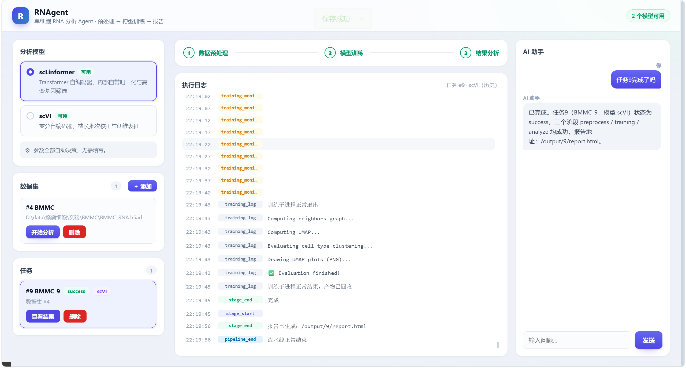
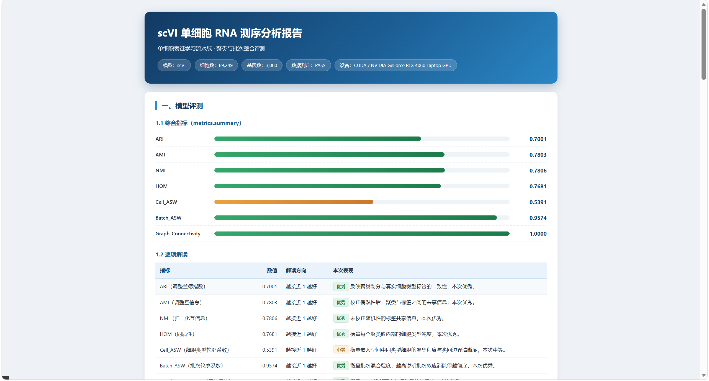
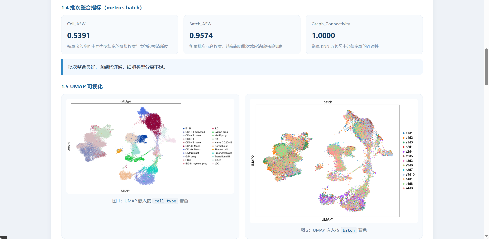

<div align="center">

# 🧬 RNAgent

**An Agent system for running any model on any single-cell dataset**

### *pick a dataset → pick a model → get a report.*

<br/>

[](https://www.python.org/)
[](https://github.com/langchain-ai/langgraph)
[](https://fastapi.tiangolo.com/)
[](https://pytorch.org/)
[](https://docs.scvi-tools.org/)
[](https://www.deepseek.com/)
[](https://www.mysql.com/)

<br/>

**Simple by design · Model-agnostic · Fully observable**

<sub>[English](README.md) · [中文](README_zn.md)</sub>

</div>

---

## 🧭 Introduction

RNAgent exists for one reason:

> **Make single-cell analysis models usable without being a pipeline engineer.**

No scripts to wire up, no parameters to tune, no environment archaeology. One dataset in, one HTML report out:

```text
┌─────────────────┐      ┌──────────────┐      ┌─────────────────┐
│ ① Pick a dataset│ ───▶ │ ② Pick a model│ ───▶ │ ③ Read the report│
└─────────────────┘      └──────────────┘      └─────────────────┘
```

Behind that simplicity is a 3-stage **LangGraph** pipeline (preprocess → model → report) that decides everything it can on its own:

| You don't have to… | RNAgent instead… |
|:---|:---|
| Configure parameters | Reads GPU / VRAM / dataset size and picks batch size, epochs and device |
| Clean up your metadata | Validates against a *judgment contract*, then repairs column names and multi-level labels |
| Know which metrics matter | Runs one shared evaluation and explains what each number means |
| Write a report | DeepSeek generates a self-contained HTML report (local template as fallback) |
| Rebuild the pipeline for a new model | A model plugin is **2 files** — API, DB, UI and report adapt automatically |

### 🧩 Supported Models

| Model | Good at | Needs |
|:---|:---|:---|
| `scLinformer` | general representation learning (normalizes internally) | raw counts in `adata.X` |
| `scVI` | batch correction & low-dimensional embedding | raw counts in `layers["counts"]` |
| *more coming* | see **What's Next** below | — |

> Any model that writes `obsm["latent"]` automatically inherits the same evaluation, the same report format and a slot in the UI — so results stay **comparable across models**.

---

## 🖼️ Showcase

### 1 · System Architecture

<p align="center">
  
</p>

<p align="center"><sub>Layered design: <b>User layer</b> → <b>API / task service</b> → <b>LangGraph orchestration</b> (with failure routing) → <b>Tools + Skills</b> → <b>Storage</b>, with MySQL, DeepSeek and model runtimes as external dependencies.</sub></p>

### 2 · Web Interface

<p align="center">
  
</p>

<p align="center"><sub><b>Left</b> pick a model and start a task · <b>Center</b> three-stage progress with a live SSE log timeline · <b>Right</b> ask the AI assistant about any task's status and report.</sub></p>

Model availability is detected at runtime — an uninstalled model is **greyed out** instead of failing mid-run. All parameters are decided automatically by default, so no configuration is required to get a result.

### 3 · Report — Evaluation Metrics

<p align="center">
  
</p>

<p align="center"><sub>Every report opens with the run context (<b>model · cell count · gene count · validation verdict · device</b>), then a score bar chart and a per-metric table explaining the <b>direction</b> of each score and grading the actual outcome (<i>优秀 / 中等</i>).</sub></p>

### 4 · Report — Batch Integration & UMAP

<p align="center">
  
</p>

<p align="center"><sub>Batch metrics as cards, an auto-generated one-line verdict, and side-by-side UMAP embeddings coloured by <code>cell_type</code> and by <code>batch</code> — the batch plot shows cells from all samples <b>thoroughly mixed</b>, exactly what <code>Batch_ASW = 0.9574</code> claims.</sub></p>

---

## 🚀 Usage

### Requirements

| | |
|:---|:---|
| **Python** | ≥ 3.10 |
| **MySQL** | 8.0 |
| **GPU** | optional — CPU works, but `torch` + CUDA is recommended |
| **Docker** | optional — enables the `execute_code` sandbox used by the repair fallback |
| **DeepSeek key** | optional — without it, reports fall back to the local template |

### Install & Run

```bash
# 1. Clone
git clone https://github.com/TRCDHH/RNAgent.git
cd z-newRnagent

# 2. Environment (conda or venv)
conda create -n rnagent python=3.10 -y && conda activate rnagent
# python -m venv .venv && .venv\Scripts\activate     # Windows
# python -m venv .venv && source .venv/bin/activate  # Linux / macOS

# 3. Dependencies (pinned to the verified environment)
pip install -r requirements.txt
# GPU users (PyPI's Windows wheel is CPU-only):
# pip install torch==2.5.1 --index-url https://download.pytorch.org/whl/cu124

# 4. Database
mysql -u root -p < init.sql

# 5. Environment variables
#    Windows (PowerShell)
$env:LLM_API_KEY="sk-xxx"
$env:SCLINFORMER_DIR="D:\code\RNAgent\model\scLinformer-main"
#    Linux / macOS
# export LLM_API_KEY=sk-xxx
# export SCLINFORMER_DIR=/opt/rnagent/model/scLinformer-main

# 6. Start  (single process only — never add --workers)
python server.py
```

Open **http://localhost:8000** → add a dataset → pick a model → **开始分析** → watch the live log → read `report.html`.

Or drive it from the command line:

```bash
curl -X POST http://localhost:8000/api/tasks/run \
  -H 'Content-Type: application/json' \
  -d '{"dataset_id":1,"model":"scvi","params":{"max_epochs":100}}'
```

### Configuration

| Variable | Default | Description |
|:---|:---|:---|
| `LLM_API_KEY` | — | DeepSeek API key (report + assistant) |
| `LLM_MODEL` | `deepseek-v4-flash` | LLM model name |
| `LLM_BASE_URL` | `https://api.deepseek.com` | OpenAI-compatible endpoint |
| `DEFAULT_MODEL` | `sclinformer` | Model used when the request omits `model` |
| `MODEL_EPOCHS` | `100` | Global training epochs (a model's `SKILL.md` may override) |
| `{MODEL_KEY}_{PARAM}` | per-model `SKILL.md` | Override one model's parameter in isolation, e.g. `SCVI_MAX_EPOCHS=200` |
| `SCLINFORMER_DIR` | `<repo>/../model/scLinformer-main` | scLinformer source directory |
| `SANDBOX_IMAGE` / `SANDBOX_TIMEOUT` / `SANDBOX_MEM_MB` / `SANDBOX_CPUS` | `rna-sandbox:latest` / `300` / `4096` / `2` | `execute_code` sandbox image and limits |

Parameter priority: **model `SKILL.md` default → `{MODEL_KEY}_{PARAM}` env → request `params` → runtime auto-decision.**

### API

| Method | Endpoint | Purpose |
|:---:|:---|:---|
| `GET` | `/api/models` | Available models **+ parameter schema** (drives the frontend form) |
| `GET` / `POST` / `DELETE` | `/api/datasets` | Manage datasets |
| `POST` | `/api/tasks/run` | Start a task — `{dataset_id, model, params}` |
| `GET` | `/api/tasks` · `/api/tasks/{id}/state` | Task list · single task state & results |
| `GET` | `/api/tasks/{id}/stream` | SSE live logs |
| `GET` | `/output/{id}/report.html` | Render the report |
| `POST` | `/api/chat` · `/api/chat/stream` | AI assistant |

### Output

Each task is fully isolated:

```text
runtime/task/{task_id}/
├── report.html                 # LLM-generated report
├── processed_rna.h5ad
├── summary_metrics.csv · cluster_metrics.csv · batch_metrics.csv
├── umap_cell_type.png · umap_batch.png
├── model/                      # weights / scVI archive
├── processed_data/             # train / valid / test splits
└── 数据处理结果分析/            # 01_数据状况 · 02_数据分析报告 · 03_操作审计
```

### Adding Your Own Model

```text
app/tools/models/backends/<key>.py          # Capabilities + ParamSpec + train()
app/skills/registry/models/<key>/SKILL.md   # parameter defaults + batch-size table
```

Two files. The registry auto-discovers it, `GET /api/models` exposes it, and the frontend renders its parameter form from the schema.

---

## 🔭 What's Next

> The two pillars are **models** and **simplicity** — everything below serves one of them.

### 🚧 In Progress

| | |
|:---|:---|
| **More models** | `scGPT` · `Geneformer` · `UCE` · `scFoundation` — the plugin layer was built for exactly this: 2 files per model, zero changes elsewhere. |
| **Simpler deployment** | A one-command `docker compose up` bundling MySQL, the sandbox image and the app — no manual MySQL / Docker setup, no path wrangling. |

### 🗺️ Planned

- **Compare models side by side** — run the same dataset through several models and diff the metrics in one view
- **One-click parameter presets** — save a proven configuration and reuse it across datasets
- **Task queue & concurrency** — today the service is deliberately single-process; Redis-backed workers are next
- **Authentication & multi-user** — accounts, isolated workspaces and quotas
- **Reproducibility manifest** — per-task environment fingerprint stored alongside the report

### ✅ Done

- [x] 3-stage LangGraph pipeline with conditional routing and error handling
- [x] Model plugin architecture — `scLinformer` and `scVI` out of the box
- [x] Judgment contract with automatic metadata repair
- [x] Environment-aware parameter and batch-size decision
- [x] Unified evaluation shared by all models
- [x] DeepSeek-generated HTML reports with local fallback
- [x] SSE live logs + append-only `events.jsonl` audit trail
- [x] Docker-isolated `execute_code` sandbox
- [x] Pinned dependencies verified against a working environment

---

<div align="center">

### 🧬 RNAgent

**Any model. Any dataset. One click.**

<sub>LangGraph × DeepSeek × scLinformer / scVI × FastAPI</sub>

</div>
