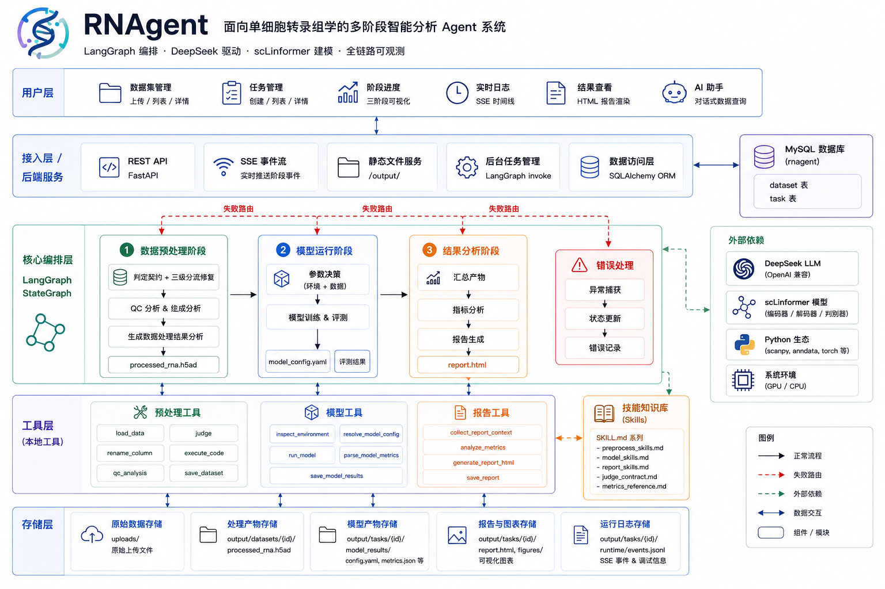
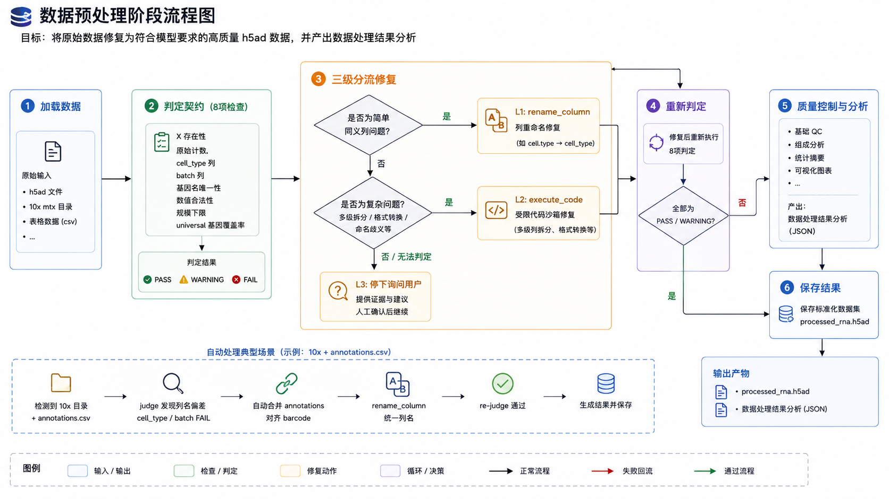

<div align="center">

# 🧬 RNAgent

### Autonomous Agent System for Single-Cell RNA-seq Analysis

**From raw data to reproducible analysis — automated, observable, and explainable.**

<br/>

[](https://www.python.org/)
[](https://github.com/langchain-ai/langgraph)
[](https://fastapi.tiangolo.com/)
[](https://pytorch.org/)
[](https://www.deepseek.com/)
[](https://www.mysql.com/)

<br/>

**LangGraph Orchestration · DeepSeek Reasoning · scLinformer Modeling · Full Observability**

</div>

---

## ✨ What is RNAgent?

RNAgent is a **multi-stage intelligent Agent system for single-cell transcriptomics analysis**.

Instead of requiring users to manually connect preprocessing scripts, model training, evaluation and report generation, RNAgent turns the entire workflow into an **Agent-driven pipeline**:

```text
Raw scRNA-seq Data
        │
        ▼
┌──────────────────┐
│  01  Preprocess  │  Detect · Validate · Repair · QC
└────────┬─────────┘
         │ structured artifacts
         ▼
┌──────────────────┐
│  02  Model       │  Inspect · Configure · Train · Evaluate
└────────┬─────────┘
         │ metrics + embeddings
         ▼
┌──────────────────┐
│  03  Analysis     │  Aggregate · Explain · Report
└────────┬─────────┘
         │
         ▼
   📄 HTML Report
```

> **Core idea:** let the Agent decide *what to do next*, while every important operation leaves a traceable artifact.

---

## 🖼️ System Overview

<p align="center">
  
</p>

RNAgent is organized around three layers of responsibility:

| Layer | Implementation | Responsibility |
|:---|:---|:---|
| **Frontend** | `app/static/` | Task creation · progress · logs · reports · AI Q&A |
| **API** | `app/api.py` | REST · SSE · static hosting |
| **Agent / Graph** | `app/graph/` | StateGraph · routing · error handling |
| **Tools** | `app/tools/` | Actual preprocessing / modeling / reporting |
| **Skills** | `app/skills/` | Decision knowledge in `SKILL.md` |
| **Persistence** | `app/db.py` | MySQL dataset / task state |

---

## 🔄 The Pipeline

### 01 · Data Preprocessing

<p align="center">
  
</p>

The preprocessing Agent does not assume that the input is already clean.

A typical workflow:

```text
Load Data
   ↓
Validate Format & Metadata
   ↓
PASS ────────────────→ Continue
   │
   ├─ WARNING → Normalize / Rename
   │
   └─ FAIL    → Repair / Execute Code
                    ↓
                  Re-check
                    ↓
                   PASS
                    ↓
                 QC Analysis
                    ↓
              Structured Artifacts
```

For example, when receiving a **10x output directory + `annotations.csv`** containing `cell.type` and `Sample`, RNAgent can detect column mismatches, align barcodes, rename columns, split multi-level labels such as `"T cell:CD4"`, re-run validation, and only continue when the required checks pass.

**Design principle:**  
> **Confirm the raw count matrix first — then do everything else.**

This prevents accidental secondary normalization or destructive preprocessing.

---

### 02 · Model Running

The model Agent connects the validated dataset to the real **scLinformer** implementation.

```text
Environment Inspection
        ↓
GPU / VRAM / Dataset Size
        ↓
Parameter Resolution
        ↓
scLinformer Training
        ↓
Embedding Evaluation
        ↓
Metrics + UMAP
```

Key decisions are made automatically:

- `use_batch` / `use_cell_type` from available `obs` columns
- `batch_size` from GPU memory + dataset size
- training configuration from the resolved environment
- real model execution rather than mocked results
- automatic fallback to smaller batch sizes when necessary

---

### 03 · Result Analysis

The reporting Agent collects artifacts from the first two stages:

```text
Dataset
+ Validation Results
+ QC Analysis
+ Training Config
+ Environment
+ Metrics
+ UMAP
+ Artifact Paths
        ↓
   DeepSeek
        ↓
Self-contained HTML Report
```

The generated report is stored at:

```text
runtime/task/{task_id}/report.html
```

If the LLM is unavailable, a local report template provides a fallback path.

---

# ⭐ Why RNAgent?

<div align="center">

| 🧩 Agent Pipeline | 🛡️ Safe Preprocessing | ⚙️ Auto Configuration |
|:---:|:---:|:---:|
| 3-stage StateGraph | Contract-based validation | GPU + data-aware |
| Conditional routing | Multi-level repair | Automatic batch sizing |
| Error handling | Re-check after repair | OOM fallback |

| 📡 Full Observability | 🧠 Skill Library | 💬 AI Analysis |
|:---:|:---:|:---:|
| SSE live events | Progressive disclosure | DeepSeek reports |
| Timeline UI | `SKILL.md` knowledge | Function calling |
| `events.jsonl` audit | Domain QA | Real metrics only |

</div>

---

## 📊 Output & Reproducibility

Every task is isolated under:

```text
runtime/task/{task_id}/
```

```text
├── report.html
├── processed_rna.h5ad
├── summary_metrics.csv
├── cluster_metrics.csv
├── batch_metrics.csv
├── umap_cell_type.png
├── umap_batch.png
│
├── model/
│   ├── rna_encoder.pth
│   ├── rna_decoder.pth
│   └── cell_type_discriminator.pth
│
├── processed_data/
│   ├── train_ids.npy
│   ├── valid_ids.npy
│   └── test_ids.npy
│
└── 数据处理结果分析/
    ├── 01_数据状况.md
    ├── 02_数据分析报告.md
    ├── 03_操作审计.md
    └── figures/
```

### Evaluation Metrics

RNAgent reports:

`ARI` · `AMI` · `NMI` · `HOM` · `Cell_ASW` · `Batch_ASW` · `Graph_Connectivity`

Interpretation:

- **ARI / AMI / NMI / HOM** → agreement with reference labels
- **Cell_ASW** → cell-type separation
- **Batch_ASW** → batch-effect behavior
- **Graph_Connectivity** → within-batch connectivity

Missing `cell_type` or `batch` columns cause the corresponding metrics to be skipped and marked **N/A**. RNAgent does **not fabricate metric values**.

---

## 🧠 Skill System

Decision knowledge is stored as modular `SKILL.md` files under:

```text
app/skills/registry/
```

| Skill | Purpose |
|:---|:---|
| `preprocess-qc` | Validation contracts + repair SOP |
| `model-running` | Parameter rules + batch-size lookup + OOM fallback |
| `report-generation` | Report artifacts + metric interpretation |
| `sc-domain-qa` | Single-cell domain knowledge |
| `training-troubleshoot` | Training failure diagnosis |
| `h5ad-conversion` | Data-format conversion |

RNAgent uses **progressive disclosure**:

```text
SkillLibrary.disclose()
        ↓
Names + descriptions only
        ↓
load(name)
        ↓
Full knowledge when needed
```

This keeps the runtime context focused while retaining domain-specific decision knowledge.

---

# 🚀 Quick Start

## Requirements

- Python **≥ 3.10**
- MySQL **8.0**
- GPU optional — CPU execution is supported
- DeepSeek API key for LLM-powered reporting / Q&A

## Installation

```bash
# 1. Clone
git clone <repo-url>
cd z-newRnagent

# 2. Create environment
python -m venv .venv

# Windows
.venv\Scripts\activate

# Linux / macOS
# source .venv/bin/activate

# 3. Install dependencies
pip install -r requirements.txt

# Optional: Aliyun mirror
# pip install -r requirements.txt -i https://mirrors.aliyun.com/pypi/simple/

# 4. Initialize MySQL
mysql -u root -p < init.sql

# 5. Configure environment
copy .env.example .env

# Linux / macOS
# cp .env.example .env

# Edit .env and set:
# LLM_API_KEY=sk-xxx

# 6. Start RNAgent
python server.py
```

Then open:

**http://localhost:8000**

```text
Create Dataset
      ↓
Start Analysis
      ↓
Observe Live Progress
      ↓
View Results
      ↓
Read HTML Report
```

---

## ⚙️ Configuration

All major settings can be overridden with environment variables.

| Variable | Default | Description |
|:---|:---|:---|
| `LLM_BASE_URL` | `https://api.deepseek.com` | OpenAI-compatible endpoint |
| `LLM_API_KEY` | — | DeepSeek API key |
| `LLM_MODEL` | `deepseek-v4-flash` | LLM model |
| `MODEL_EPOCHS` | `1` | Training epochs |
| `MODEL_BATCH_SIZE` | Auto | GPU / dataset-aware batch size |
| `SCLINFORMER_DIR` | `../../model/scLinformer-main` | scLinformer source directory |

---

# 📡 API

| Method | Endpoint | Purpose |
|:---:|:---|:---|
| `GET` | `/api/datasets` | List datasets |
| `POST` | `/api/datasets` | Create dataset |
| `DELETE` | `/api/datasets/{id}` | Delete dataset |
| `POST` | `/api/tasks/run` | Start analysis task |
| `GET` | `/api/tasks` | List tasks |
| `GET` | `/api/tasks/{id}/state` | Get task state / results |
| `GET` | `/api/tasks/{id}/stream` | SSE logs / progress |
| `GET` | `/output/{id}/report.html` | View HTML report |
| `POST` | `/api/chat` | AI assistant |
| `POST` | `/api/chat/stream` | Streaming AI assistant |

---

# 🗂️ Project Structure

```text
z-newRnagent/
├── server.py
├── run_demo.py
├── init.sql
├── requirements.txt
│
└── app/
    ├── api.py
    ├── main.py
    ├── state.py
    ├── config.py
    ├── db.py
    ├── llm.py
    ├── event_emitter.py
    │
    ├── static/
    │   └── index.html
    │
    ├── graph/
    │   ├── builder.py
    │   └── nodes.py
    │
    ├── tools/
    │   ├── preprocess_tools.py
    │   ├── model_tools.py
    │   ├── report_tools.py
    │   ├── assistant_tools.py
    │   └── local_tools.py
    │
    └── skills/
        ├── library.py
        └── registry/
```

---

# 🛣️ Roadmap

### Completed

- [x] LangGraph 3-stage orchestration
- [x] Conditional routing + error handling
- [x] Validation contracts + multi-level repair
- [x] QC analysis + audit artifacts
- [x] Real scLinformer training + evaluation
- [x] Automatic parameter / batch-size decisions
- [x] DeepSeek HTML report generation
- [x] AI assistant with function calling
- [x] SSE real-time progress
- [x] MySQL persistence

### Next

- [ ] Redis checkpoint & resumable execution
- [ ] Langfuse full-chain tracing
- [ ] Docker-isolated `execute_code`
- [ ] Vue 3 frontend

---

## 🔬 Design Philosophy

RNAgent is built around four principles:

**01 — Validate before acting**  
Never assume that incoming biological data already satisfies model requirements.

**02 — Let the Agent decide, not fabricate**  
Agents orchestrate real tools and real model execution. Results come from artifacts, not imagination.

**03 — Every step should be observable**  
Progress, decisions, tool calls and outputs should remain inspectable after execution.

**04 — Knowledge should be reusable**  
Domain decisions live in Skills instead of being hard-coded into a single pipeline.

---

<div align="center">

### 🧬 RNAgent

**Making single-cell analysis workflows autonomous.**

<br/>

*LangGraph × DeepSeek × scLinformer × FastAPI*

</div>
