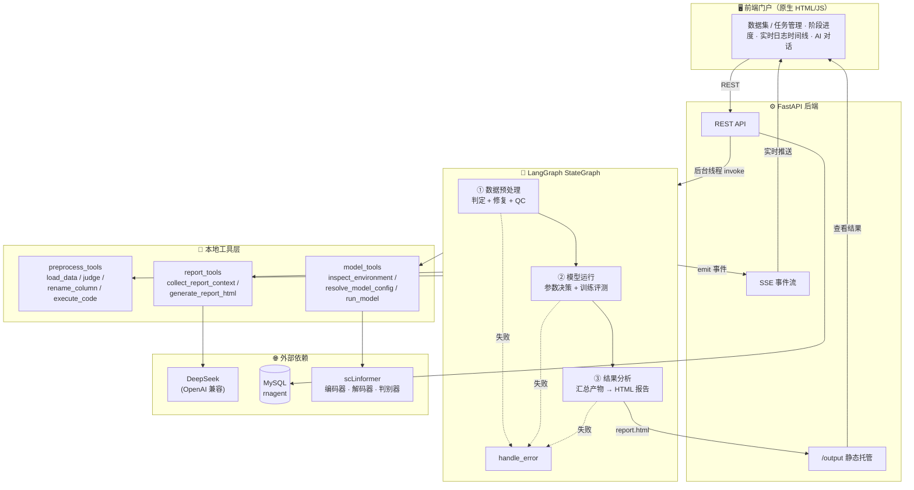
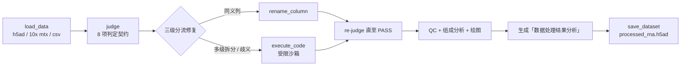

<div align="center">

# 🧬 RNAgent

**面向单细胞转录组学的多阶段智能分析 Agent 系统**

*LangGraph 编排 · DeepSeek 驱动 · scLinformer 建模 · 全链路可观测*

[](https://www.python.org/)
[](https://github.com/langchain-ai/langgraph)
[](https://fastapi.tiangolo.com/)
[](https://www.deepseek.com/)
[](https://www.mysql.com/)
[](https://pytorch.org/)
[](https://en.wikipedia.org/wiki/Single-cell_sequencing)

[快速开始](#-快速开始) · [系统架构](#-系统架构) · [流水线详解](#-流水线详解) · [API 文档](#-api-文档) · [Roadmap](#-roadmap)

---

从一份原始的单细胞 RNA 测序数据，到一份可解读的完整分析报告 —— 全程由 Agent 自主决策：

**格式判定 → 智能修复 → 参数决策 → 模型训练 → 指标评测 → 报告生成**

</div>

---

## 📑 目录

- [✨ 核心特性](#-核心特性)
- [🏗️ 系统架构](#-系统架构)
- [🔄 流水线详解](#-流水线详解)
- [🚀 快速开始](#-快速开始)
- [⚙️ 配置项](#️-配置项)
- [📡 API 文档](#-api-文档)
- [📦 任务产物清单](#-任务产物清单)
- [🧠 Skill 系统](#-skill-系统)
- [📁 项目结构](#-项目结构)
- [🗺️ Roadmap](#-roadmap)

---

## ✨ 核心特性

### 1. 三阶段 Agent 流水线

数据预处理、模型运行、结果分析三个阶段由 LangGraph `StateGraph` 编排，阶段间以结构化产物衔接，失败自动路由至错误处理节点，全程状态可追溯。

### 2. 判定契约 + 三级分流修复

预处理阶段不是简单的格式转换，而是一套「先诊断、再修复」的智能流程：

- **判定契约**：8 项检查（X 存在性 / 原始计数 / cell_type / batch / 基因名唯一性 / 数值合法性 / 规模下限 / universal 基因覆盖率），逐项输出 `PASS / WARNING / FAIL` + 证据 + 建议动作
- **三级分流修复**：
  1. 简单同义列 → `rename_column`（如 `cell.type` → `cell_type`）
  2. 复杂情况 → `execute_code` 受限沙箱兜底（多级列拆分、格式转换、命名歧义）
  3. 无法判定 → 停下询问，绝不瞎猜
- **核心原则**：*先确认原始计数，再谈其它* —— 避免模型内部二次归一化导致数据失真

### 3. 智能参数决策

模型运行阶段像一名「只负责传参和执行」的 Agent，基于上一步产物 + 本机环境自动决策：

| 参数 | 决策依据 |
|------|----------|
| `use_batch` | 预处理产物 `obs` 是否含 `batch` 列（缺失列会导致模型崩溃） |
| `use_cell_type` | `obs` 是否含 `cell_type` 列 |
| `batch_size` | 显存大小 + 细胞数查表（无 GPU→32，≥24GB→512，小样本自动收窄） |
| `use_universal_model` | 固定 `False` |
| 其他 | 沿用 scLinformer `train.py` 默认值 |

### 4. 全链路可观测

每个阶段的关键动作实时推送（SSE），前端时间线逐条展示；事件同步落盘 `runtime/events.jsonl` 供审计。

### 5. DeepSeek 驱动的报告与对话

- **结果分析**：汇总两阶段全部产物，由 DeepSeek 生成专业 HTML 分析报告（未配置 LLM 时本地模板兜底）
- **AI 助手**：基于 function calling 查询真实数据集 / 任务状态 / 评测指标，不编造数据

### 6. Skill 系统（渐进式披露）

每个阶段的决策知识沉淀为 `SKILL.md`（判定契约、参数查表、指标解读规范），常驻只暴露 name + description，用到才加载全文 —— 省 token，可维护。

---

## 🏗️ 系统架构



**分层职责**：

| 层 | 模块 | 职责 |
|----|------|------|
| 前端 | `app/static/` | 任务触发、进度观测、报告查看、AI 问答 |
| 后端 | `app/api.py` | REST + SSE + 静态托管，纯业务门户（无 AI 逻辑） |
| 编排 | `app/graph/` | 三阶段 StateGraph + 条件路由 + 错误处理 |
| 工具 | `app/tools/` | 各阶段实际执行逻辑（全本地，无 MCP） |
| 知识 | `app/skills/` | SKILL.md 决策知识库 |
| 持久化 | `app/db.py` | MySQL（`dataset` / `task` 表） |

---

## 🔄 流水线详解

### 阶段一：数据预处理



典型场景（自动处理）：**10x 输出目录 + 含 `cell.type` 与 `Sample` 的 annotations.csv**

> `load_data` 检测非 h5ad 且列名偏差 → `judge` 判 cell_type/batch FAIL → 合并 annotations（自动对齐 barcode `-1` 后缀）→ `rename_column` 改名 → 多级值（如 `"T cell:CD4"`）升级 `execute_code` 拆分 → 重跑 judge 全 PASS → 数据分析 → 生成产物 → 保存交训练。

### 阶段二：模型运行

1. **环境探测**：`inspect_environment` 查询 GPU 型号 / 显存
2. **参数决策**：读取预处理产物的 `obs` 列 + 显存 + 数据量 → `resolve_model_config`
3. **训练评测**：调用真实 scLinformer `Model`，训练后执行嵌入评测，产出指标 CSV + UMAP

### 阶段三：结果分析

`collect_report_context` 汇总两阶段全部产物（数据规模、判定结论、训练配置、环境、指标、UMAP、产物路径）→ DeepSeek 生成自包含 HTML 报告 → 保存至 `runtime/task/{task_id}/report.html`。

---

## 🚀 快速开始

### 环境要求

- Python **≥ 3.10**
- 本地 **MySQL 8.0**（需可登录 root 执行初始化）
- GPU 可选（CPU 亦可运行，batch_size 自动降级）

### 安装与启动

```bash
# 1) 克隆并进入项目
git clone <repo-url> && cd z-newRnagent

# 2) 创建虚拟环境
python -m venv .venv
.venv\Scripts\activate            # Windows
# source .venv/bin/activate       # Linux / macOS

# 3) 安装依赖（默认源慢可用阿里镜像）
pip install -r requirements.txt -i https://mirrors.aliyun.com/pypi/simple/

# 4) 初始化数据库（首次，输入 root 密码）
mysql -u root -p < init.sql

# 5) 配置 DeepSeek API Key
copy .env.example .env             # Windows
# cp .env.example .env             # Linux / macOS
# 编辑 .env 填入 LLM_API_KEY，或直接设环境变量：
#   $env:LLM_API_KEY = "sk-xxx"

# 6) 启动
python server.py
```

浏览器打开 **http://localhost:8000**，体验完整流程：

**新建数据集（名称 + 本地 h5ad 路径）→ 点击「开始分析」→ 实时观察三阶段进度与日志 → 点击「查看结果」阅读 HTML 分析报告**

---

## ⚙️ 配置项

全部支持环境变量覆盖：

| 变量 | 默认值 | 说明 |
|------|--------|------|
| `LLM_BASE_URL` | `https://api.deepseek.com` | OpenAI 兼容接口地址 |
| `LLM_API_KEY` | —（必填才启用 LLM） | DeepSeek API Key |
| `LLM_MODEL` | `deepseek-v4-flash` | 模型名 |
| `MODEL_EPOCHS` | `1` | 训练轮数（演示用 1，真实训练可调大） |
| `MODEL_BATCH_SIZE` | 自动 | 留空按显存+数据量查表；OOM 时可手动调小 |
| `SCLINFORMER_DIR` | `../../model/scLinformer-main` | scLinformer 源码目录 |

---

## 📡 API 文档

| 方法 | 路径 | 说明 |
|------|------|------|
| `GET` | `/api/datasets` | 数据集列表 |
| `POST` | `/api/datasets` | 新建数据集 `{"name": "...", "path": "D:/data/demo.h5ad"}` |
| `DELETE` | `/api/datasets/{id}` | 删除数据集 |
| `POST` | `/api/tasks/run` | 触发分析任务 `{"dataset_id": 1}`，返回 `task_id` |
| `GET` | `/api/tasks` | 任务列表（含过程状态） |
| `GET` | `/api/tasks/{id}/state` | 任务完整过程 / 结果（JSON） |
| `GET` | `/api/tasks/{id}/stream` | **SSE** 订阅事件流（日志 / 进度） |
| `GET` | `/output/{id}/report.html` | 任务生成的 HTML 分析报告 |
| `POST` | `/api/chat` | AI 助手对话（可查询任务真实指标） |
| `POST` | `/api/chat/stream` | AI 助手流式对话（**SSE**） |

---

## 📦 任务产物清单

每次任务输出至 `runtime/task/{task_id}/`：

```
runtime/task/{task_id}/
├── report.html                  # 最终 HTML 分析报告（DeepSeek 生成）
├── processed_rna.h5ad           # 修复后的原始计数矩阵（交训练）
├── summary_metrics.csv          # 总评测：ARI / AMI / NMI / HOM / Cell_ASW / Batch_ASW / Graph_Connectivity
├── cluster_metrics.csv          # 各 resolution 聚类指标（有 cell_type 才有）
├── batch_metrics.csv            # 批次 / ASW 指标（有 batch 才有）
├── umap_cell_type.png           # UMAP（cell_type 着色）
├── umap_batch.png               # UMAP（batch 着色）
├── model/                       # 模型权重
│   ├── rna_encoder.pth
│   ├── rna_decoder.pth
│   └── cell_type_discriminator.pth
├── processed_data/              # 数据划分（64/16/20）
│   ├── train_ids.npy
│   ├── valid_ids.npy
│   └── test_ids.npy
└── 数据处理结果分析/              # 预处理阶段产物
    ├── 01_数据状况.md             # 判定结论 + 对模型配置的影响（固定句式）
    ├── 02_数据分析报告.md         # 单细胞通用分析模板（QC / 组成 / 覆盖率）
    ├── 03_操作审计.md             # 全部操作记录（时间 / 工具 / 代码，可追溯）
    └── figures/                  # QC 图（UMI 分布 / UMI-基因相关 / 组成柱状图）
```

**指标解读规范**：ARI / AMI / NMI / HOM 越接近 1 聚类与真实标签越一致；Cell_ASW 越大细胞类型分离越好；Batch_ASW 反映去批次效果；Graph_Connectivity 越接近 1 批次内连通性越好。缺 `cell_type` / `batch` 时对应指标跳过并标注 N/A，**绝不编造数值**。

---

## 🧠 Skill 系统

决策知识以 `SKILL.md` 形式沉淀在 `app/skills/registry/`，运行时按需加载：

| Skill | 作用 |
|-------|------|
| `preprocess-qc` | 判定契约清单 + 三级分流修复 SOP |
| `model-running` | 参数决策规则 + batch_size 查表 + 数据量案例 + OOM 兜底 |
| `report-generation` | 产物清单 + 分析要点 + 指标解读规范 + 缺列固定说法 |
| `sc-domain-qa` | 单细胞领域问答知识 |
| `training-troubleshoot` | 训练故障排查 |
| `h5ad-conversion` | 数据格式转换指南 |

`SkillLibrary.disclose()` 常驻只暴露名称与描述；`load(name)` 按需加载全文 —— 渐进式披露，节省 token。

---

## 📁 项目结构

```
z-newRnagent/
├── server.py                        # 启动入口（python server.py）
├── run_demo.py                      # 纯 CLI 演示入口
├── init.sql                         # MySQL 建库 / 建用户 / 建表
├── requirements.txt
└── app/
    ├── api.py                       # FastAPI：REST + SSE + 静态托管
    ├── main.py                      # 流水线执行（CLI 与 API 共用）
    ├── state.py                     # PipelineState（顶层状态）
    ├── config.py                    # 全局配置（环境变量可覆盖）
    ├── db.py                        # MySQL 数据访问层
    ├── llm.py                       # LLM 工厂（ChatOpenAI → DeepSeek）
    ├── event_emitter.py             # 事件流（内存缓冲 + jsonl 落盘）
    ├── static/
    │   └── index.html              # 前端门户
    ├── graph/
    │   ├── builder.py              # 组装 StateGraph
    │   └── nodes.py                # 三阶段节点 + 条件路由
    ├── tools/
    │   ├── preprocess_tools.py    # 预处理：9 个工具 + 编排入口
    │   ├── model_tools.py          # 模型运行：环境/决策/训练评测
    │   ├── report_tools.py         # 结果分析：上下文汇总 + 报告生成
    │   ├── assistant_tools.py      # AI 助手 function calling 工具
    │   └── local_tools.py          # 阶段入口转发
    └── skills/
        ├── library.py              # Skill 库（渐进式披露）
        └── registry/               # 6 个 SKILL.md
```

---

## 🗺️ Roadmap

- [x] LangGraph 三阶段编排 + 条件路由 + 错误处理
- [x] 预处理：判定契约 + 三级分流修复 + QC 分析 + 审计产物
- [x] 模型运行：接真实 scLinformer + 参数自动决策 + 评测指标
- [x] 结果分析：DeepSeek 生成 HTML 报告（本地模板兜底）
- [x] AI 助手 function calling（查询真实任务指标）
- [x] SSE 实时推送 + MySQL 持久化
- [ ] Checkpoint 接 Redis（断点续跑）
- [ ] 接入 Langfuse 全链路 Trace
- [ ] execute_code 沙箱升级 Docker 隔离
- [ ] 前端迁移 Vue 3

---

<div align="center">

**RNAgent** — 让单细胞数据分析流程自主运转

</div>
